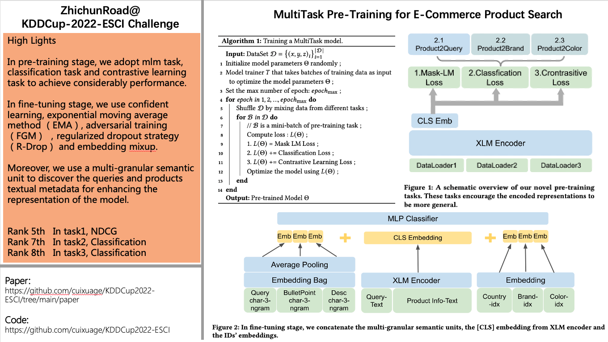

# ZhichunRoad@Amazon KDD Cup 2022   
MultiTask Pre-Training for E-Commerce Product Search   
   
**1.Abstract:**     
In pre-training stage, we adopt mlm task, classification task and contrastive learning task to achieve considerably performance.    
In fine-tuning stage, we use confident learning, exponential moving average method (EMA), adversarial training (FGM) and regularized dropout strategy (R-Drop) to improve the model's generalization and robustness.    
Moreover, we use a multi-granular semantic unit to discover the queries and products textual metadata for enhancing the representation of the model.   
Our approach obtained competitive results and ranked top-8 in three tasks.   
    


**2.Code & Ranking**     
ZhichunRoad At Amazon KDD Cup 2022    
```
+-----------+---------------------------+-------------------+-----------+
|  SubTask  |         Methods           |       Metric      |  Ranking  |
+-----------+---------------------------+-------------------+-----------+
|   task1   |  ensemble 6 large models  |    ndcg=0.9025    |    5th    |
+-----------+---------------------------+-------------------+-----------+
|   task2   |    only 1 large model     |  micro f1=0.8194  |    7th    |
+-----------+---------------------------+-------------------+-----------+
|   task3   |    only 1 large model     |  micro f1=0.8686  |    8th    |
+-----------+---------------------------+-------------------+-----------+
```